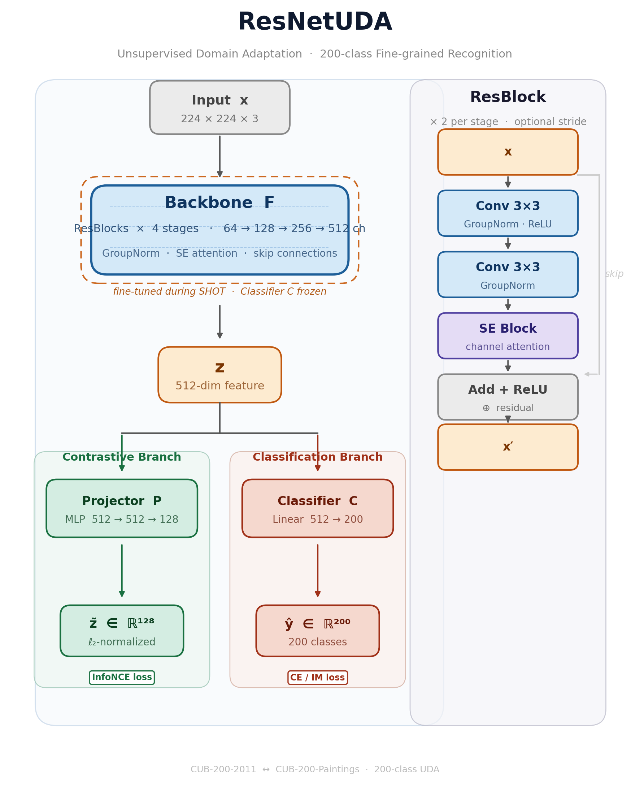
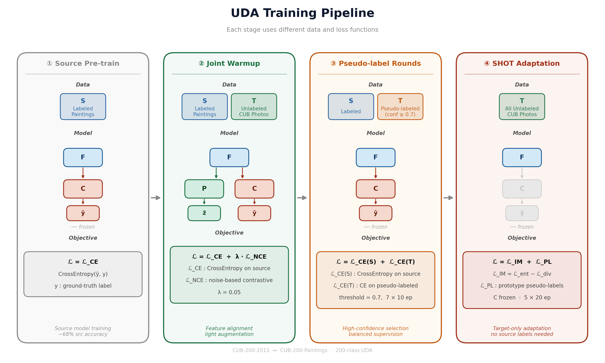

# Unsupervised Domain Adaptation — CUB-200 Photo ↔ Painting

Code for **MLDL2 HW3**: Unsupervised Domain Adaptation between CUB-200-2011 photographs and CUB-200-Paintings across 200 fine-grained bird categories.

## Results

| Setting | Method | Target Acc. |
|---|---|---|
| **C→P** (Photos → Paintings) | Joint Warmup (no aug) | 32.88% |
| | Joint Warmup (light aug) | 35.67% |
| | + SHOT 3r×15ep | 38.69% |
| | + SHOT 5r×20ep + label smooth | **45.29%** |
| **P→C** (Paintings → Photos) | Source only (80ep, light aug) | 12.20% |
| | + SHOT 3r×15ep | **13.32%** |

## Architecture



ResNetUDA is a ResNet-18-scale backbone (11.7M params, **no pretrained weights**) with GroupNorm and SE-attention blocks. Two heads branch from the 512-dim feature:
- **Projector P** (MLP 512→512→128, ℓ₂-normalized) — for InfoNCE contrastive loss
- **Classifier C** (Linear 512→200) — for CE and Information Maximization loss

## Training Pipeline



Four-stage pipeline:

1. **Source Pre-train** — CE loss on labeled source (SGD, lr=0.01, cosine decay)
2. **Joint Warmup** — Source CE + noise-based InfoNCE on unlabeled target (λ=0.05, 30 ep)
3. **Pseudo-label Rounds** — High-confidence (τ=0.7) target predictions used as pseudo-labels; 7 rounds × 10 ep, coverage grows from ~11% to ~55% *(C→P only)*
4. **SHOT Adaptation** — Freeze C, update F via Information Maximization + prototype pseudo-labels; 100% target coverage

> **P→C note:** Stage 3 causes collapse (tiny 3047-image source → noisy pseudo-labels). SHOT is applied directly after Stage 1.

## Key Findings

- **Light augmentation** (ColorJitter, HFlip, Rotation) is critical — heavy aug (50% grayscale, GaussianBlur, RandomErasing) collapses pseudo-label confidence below τ=0.7
- **SGD + cosine decay** outperforms AdamW by 4+ pp for this task
- **Label smoothing** (ε=0.05) + longer SHOT (5r×20ep, lr=5e-4) adds ~7 pp on C→P

## Repository Structure

```
uda_search/
├── src/
│   ├── models.py        # ResNetUDA (backbone, projector, classifier)
│   ├── training.py      # joint warmup, pseudo-label rounds
│   ├── shot.py          # SHOT adaptation (IM loss + prototype pseudo-labels)
│   ├── data.py          # CUB-200 / CUB-Paintings data loaders
│   ├── dann.py          # DANN baseline
│   └── mcd.py           # MCD baseline
├── configs/
│   ├── best_multiseed.json   # best configs (seeds 42/123/456/789)
│   ├── ctop_sweep.json       # C→P augmentation/optimizer sweep
│   └── ptoc_sweep.json       # P→C sweep
├── run_one.py           # single-config training entry point
├── draw_arch.py         # figure generation (arch.png, training.png)
└── download_data.sh     # download CUB-200-2011 + Paintings
```

## Setup

```bash
# install dependencies (uv)
uv sync

# or pip
pip install torch torchvision tqdm

# download data
bash download_data.sh
```

## Training

```bash
# run best C→P config (seed 42)
python run_one.py --config configs/best_multiseed.json --name ctop_best_seed42

# run best P→C config
python run_one.py --config configs/best_multiseed.json --name ptoc_best_seed42
```

## Reference

- J. Liang et al., *"Do We Really Need to Access the Source Data? Source Hypothesis Transfer for Unsupervised Domain Adaptation"*, ICML 2020 (**SHOT**)
- C. Wah et al., *"The Caltech-UCSD Birds-200-2011 Dataset"*, Caltech Tech Report, 2011
